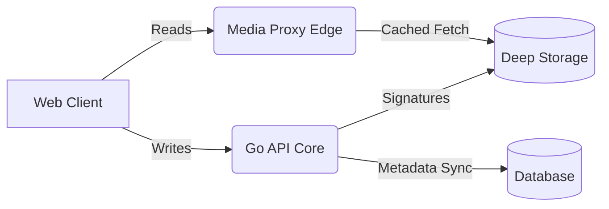
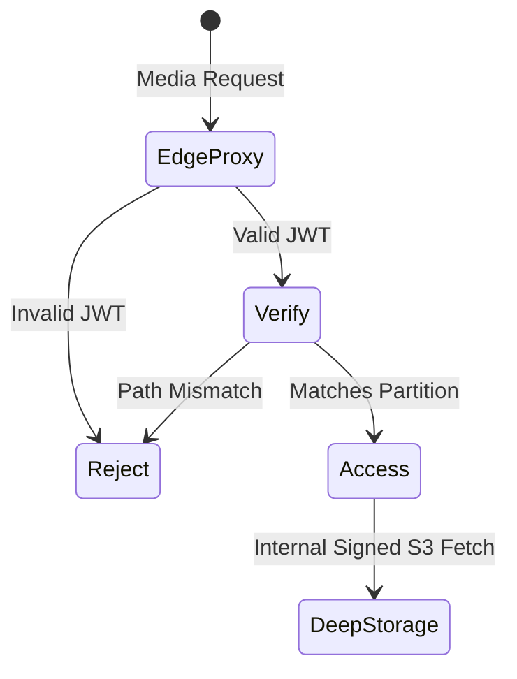
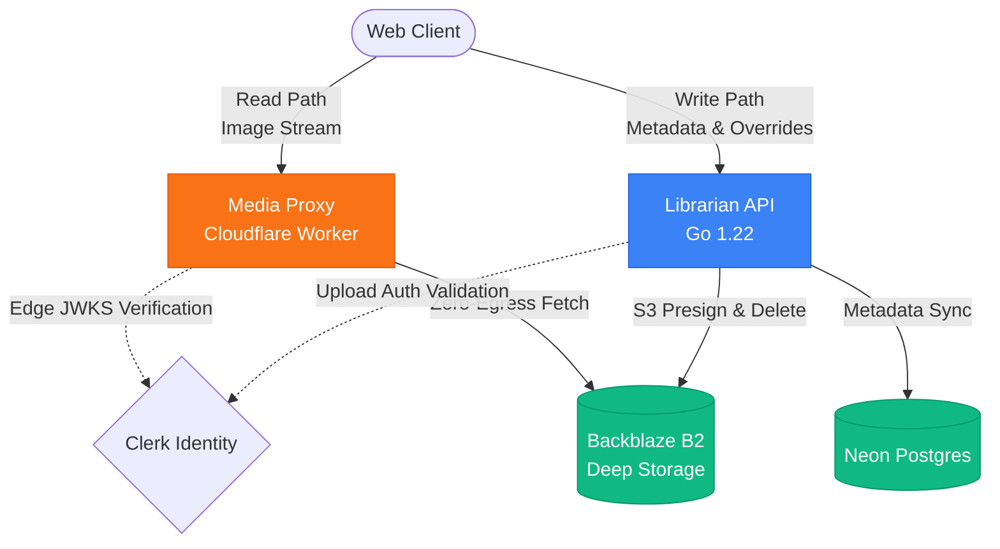
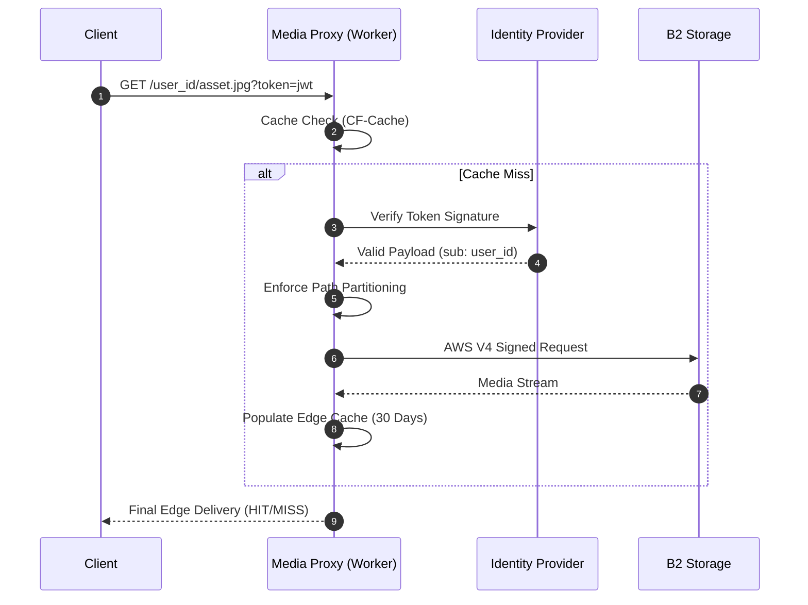

# Engram

> **Your life, fully owned.** A high-performance, edge-optimized personal media vault.

Engram was built to solve the "private social media" problem. For years, the easiest way to digitally scrapbook life was to use a private Instagram account. While convenient, it meant sacrificing true data ownership, privacy, and media fidelity.

Engram reclaims that space. It delivers the fluid, instant experience of a modern social network, but is underpinned by a zero-trust, fully owned, and heavily cached distributed architecture.

## 🏗️ System Architecture

Engram is divided into three distinct distributed systems, separating the read-path from the write-path for maximum scale and security.



- **Web (The Interface):** The user-facing client. It delivers a fluid, app-like gallery experience for rendering media, managing layouts, and handling user sessions.
- **API (The Librarian):** The absolute authority for the **Write Path**. It manages metadata, orchestrates database synchronization, processes deletions, and generates secure presigned signatures for direct-to-cloud uploads.
- **Media Proxy (The Edge Gateway):** The high-speed engine for the **Read Path**. It intercepts all media requests at the network edge, cryptographically verifies user access tokens, and streams private assets directly from deep storage while heavily caching them to eliminate egress costs.

## ⚡ Infrastructure & Tech Stack

Engram is a monorepo orchestrated by **Turborepo** and **pnpm**, heavily utilizing modern serverless and edge computing.

**Frontend & Interface**

- **Framework:** Next.js (React)
- **Styling:** Tailwind CSS, shadcn/ui
- **Hosting:** Vercel (`engram.aidanfroggatt.com`)

**Backend & Data**

- **Core API:** Go (1.22+)
- **ORM:** Ent
- **Database:** Neon Serverless Postgres
- **Hosting:** Render / VPS (`api.engram.aidanfroggatt.com`)

**Edge & Storage**

- **Media Gateway:** Cloudflare Workers (`media.engram.aidanfroggatt.com`)
- **Deep Storage:** Backblaze B2 (Private S3-compatible buckets)
- **Identity:** Clerk (JWT-based Edge Auth)

## 📂 Project Topology

```text
engram/
├── apps/
│   ├── api/                 # Go API (Metadata, Upload Auth, Sync)
│   ├── media-proxy/         # Cloudflare Worker (Edge Auth, B2 Fetch)
│   └── web/                 # Next.js Frontend (UI, Gallery)
├── packages/
│   ├── eslint-config/       # Shared linting rules
│   ├── typescript-config/   # Shared tsconfig
│   └── ui/                  # Shared React component library
├── turbo.json               # Turborepo orchestration
└── package.json             # Root workspace config
```

## 🚀 Developer Quick Start

### Prerequisites

- Node.js & pnpm
- Go (1.22+)
- Wrangler CLI (Cloudflare)

### 1. Environment Configuration

You will need to configure environment variables across the three primary apps.

**`apps/api/.env.local`** (The Librarian)

```env
APP_ENV="development"
ALLOWED_ORIGIN="http://localhost:3000"
DATABASE_URL="postgresql://[user]:[password]@[neon-host]/[db]?sslmode=require"
JWKS_URL="https://[your-clerk-domain]/.well-known/jwks.json"
B2_KEY_ID="your_b2_key_id"
B2_APP_KEY="your_b2_app_key"
B2_ENDPOINT="s3.us-east-005.backblazeb2.com"
B2_BUCKET_NAME="engram-dev"
CLOUDFLARE_PROXY_URL="[http://127.0.0.1:8787](http://127.0.0.1:8787)"
```

**`apps/media-proxy/.dev.vars`** (The Edge Gateway - _Do not commit_)

```env
B2_KEY_ID="your_b2_key_id"
B2_APP_KEY="your_b2_app_key"
```

**`apps/media-proxy/wrangler.jsonc`** (Public Edge Config)

```jsonc
{
  "vars": {
    "B2_ENDPOINT": "s3.us-east-005.backblazeb2.com",
    "B2_BUCKET_NAME": "engram-dev",
    "JWKS_URL": "https://[your-clerk-domain]/.well-known/jwks.json",
  },
}
```

**`apps/web/.env.local`** (The Interface)

```env
NEXT_PUBLIC_CLERK_PUBLISHABLE_KEY="pk_test_..."
CLERK_SECRET_KEY="sk_test_..."
NEXT_PUBLIC_API_URL="http://localhost:8080"
```

### 2. Ignition

Install all workspace dependencies from the root:

```bash
pnpm install
```

Boot the entire distributed system (Web, Go API, and Cloudflare Proxy) simultaneously using Turborepo:

```bash
pnpm dev
```

- **Web:** `http://localhost:3000`
- **Go API:** `http://localhost:8080`
- **Media Proxy:** `http://127.0.0.1:8787`

## 🔒 Security Posture

Engram operates on a strict "Zero Trust" model. Every layer requires verification, and storage is completely isolated from the public web.



1. **Dark Buckets:** Deep storage (Backblaze B2) is completely isolated from the public internet. No direct bucket access is permitted.
2. **Edge Verification:** The media proxy requires a cryptographically signed Clerk JWT for every read request. Invalid or missing tokens are rejected in `<10ms` at the network edge before ever touching deep storage.
3. **Partitioned Namespaces:** File access is strictly scoped to the authenticated user's ID (`/user_id/asset.jpg`). The proxy enforces this partition, preventing horizontal object enumeration.

## 🗺️ System Topology

To understand how Engram maintains zero-egress reads while securing the write-path, refer to the data flow diagrams below.

### High-Level Architecture

The system completely decouples the heavy-lifting of media delivery from the relational metadata logic.



### The Read Path (Edge Gateway)

When a client requests media, the Go API is bypassed entirely. The Cloudflare Worker handles the request lifecycle in under 10ms.



## 🛠️ Engineering Rigor & Automation

Engram is designed for high-velocity, solo development without sacrificing production stability. The monorepo utilizes a "Quality Gate" philosophy, where no code reaches `main` without passing a battery of automated checks.

### 🔄 The Quality Gate (CI)

Our **GitHub Actions** pipeline serves as the ultimate arbiter of code quality. Every Pull Request triggers a parallelized suite of tasks orchestrated by **Turborepo**:

- **Linting & Formatting:** Enforces a zero-warning policy across the Go and TypeScript stacks using ESLint 9 and Prettier.
- **Type Integrity:** Validates the entire workspace graph, ensuring shared packages (`@repo/ui`, etc.) remain compatible with their consumers.
- **Test Suites:** - **Edge Logic:** Vitest-powered co-located tests for the Media Proxy, verifying auth partitions and B2 signing logic.
  - **Core API:** Native Go test suites verifying configuration loaders and metadata orchestration.

### 🛡️ Security & Integrity

- **Verified Commits:** The repository enforces **SSH Commit Signing**. Every commit is cryptographically verified to ensure the integrity of the history and prevent identity spoofing.
- **Branch Protection:** The `main` branch is locked. Merges require a green CI status, a linear history, and an explicit Pull Request, protecting the production environment from accidental "hot-fixes."
- **Pre-commit Rigor:** Local development is guarded by **Husky** and **lint-staged**. Linting and formatting are applied automatically before a commit can even be created, keeping the remote history clean.

### 🚀 Continuous Delivery (CD)

Deployments are entirely hands-off and integrated directly into the Git workflow:

- **Web (Vercel):** Every PR generates a unique preview environment. Merges to `main` trigger an atomic production roll-out.
- **Media Proxy (Cloudflare):** Managed via native GitHub integration, deploying the edge gateway to 300+ global locations on every merge.
- **API (Render):** Our Go "Librarian" is automatically built and deployed as a high-performance web service, complete with automatic health checks and zero-downtime deploys.
